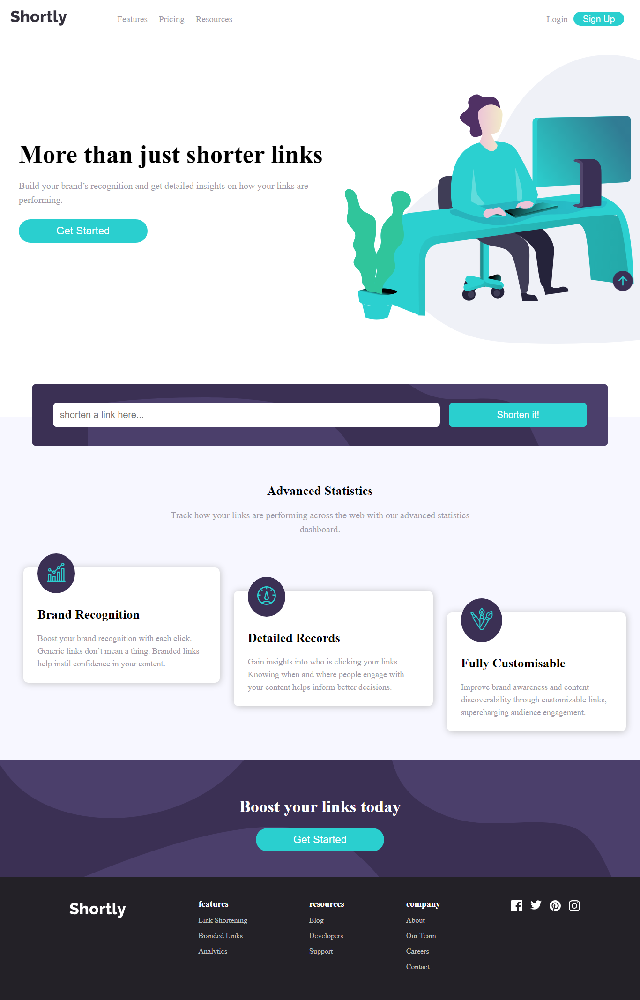

# Frontend Mentor - URL shortening API Challenge solution

This is a solution to the [Shortly URL shortening API Challenge challenge on Frontend Mentor](https://www.frontendmentor.io/challenges/url-shortening-api-landing-page-2ce3ob-G). Frontend Mentor challenges help you improve your coding skills by building realistic projects. 

## Table of contents

- [Overview](#overview)
  - [The challenge](#the-challenge)
  - [Screenshot](#screenshot)
  - [Links](#links)
- [My process](#my-process)
  - [Built with](#built-with)
  - [What I learned](#what-i-learned)

## Overview

My task was to build out the responsive landing page project to the designs inside the `/design` folder, and get it looking as close to the design as possible.

## The challenge

Users should be able to:

- View the optimal layout for the site✅ depending on their device's screen size
- Shorten any valid URL✅
- See a list of their shortened links, even after refreshing the browser✅
- Copy the shortened link to their clipboard in a single click✅
- Receive an error message when the `form` is submitted if:
  - The `input` field is empty✅

## Desktop Screenshot

## Links

- Solution URL: [Add solution URL here](https://github.com/Sarah-okolo/url-shortener-app)
- Live Site URL: [Add live site URL here](https://shorten-long-urls.netlify.app/)

## My process (in order)

- Created the HTML structure of the page
- Styled the document mobile first with CSS
- Implemented the mobile menu functionality in JS
- Implemented the API call functionality to shorten links.
- Handled any API related errors
- Stored links in local storage to be accessed even after page load
- Added copy and delete funcitonality to the shortened links
- Uploaded project to a git repository
- Deployed project to live site in Netlify

## Built with

- Semantic HTML5 markup
- CSS custom properties
- Flexbox
- CSS Grid
- Mobile-first workflow
- Vanilla JavaScript 
- [url shortener service API](https://url-shortener-service.p.rapidapi.com)

## What I learned

This project made me get a better understanding of how to work with the local storage. It also enhanced my CSS skills, as I had to work with quite a number of properties for the first time. Also getting better at using the JavaScript Async functions for API calls.

## Author
- Frontend Mentor - [@yourusername](https://www.frontendmentor.io/profile/Sarah-okolo)